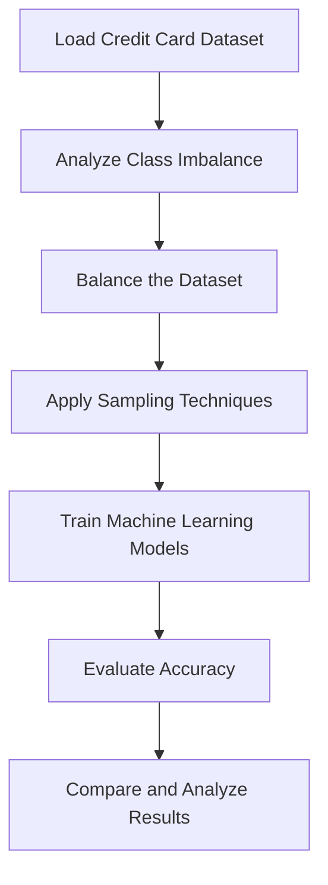
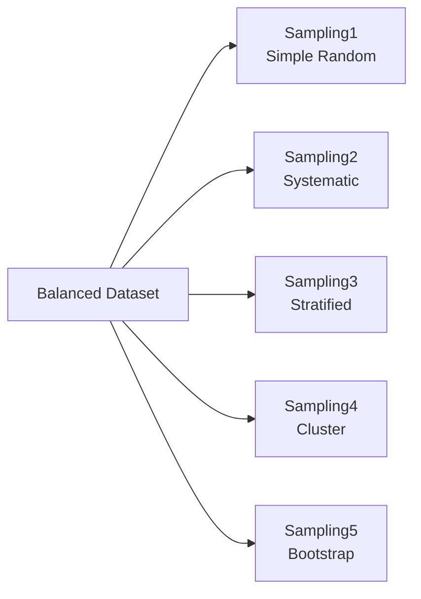
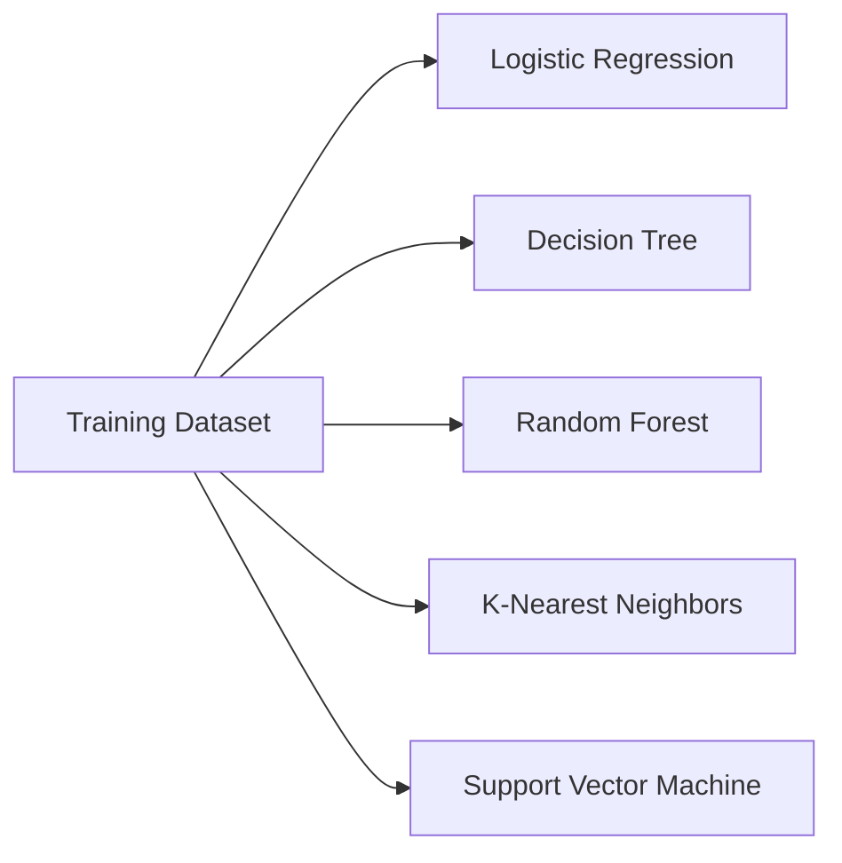
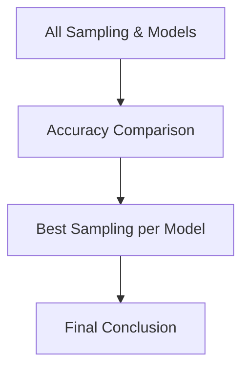

# Sampling Techniques on Imbalanced Credit Card Dataset

## 📌 Project Overview

This project analyzes how different **sampling techniques** influence the performance of multiple **machine learning models** when applied to a **credit card fraud detection dataset**.  
The complete experimentation workflow is implemented in a Jupyter Notebook (`.ipynb`) to ensure **reproducibility, clarity, and ease of understanding**.

The primary objective of this project is **to study the impact of sampling strategies on model performance**, rather than to only maximize accuracy.

---

## 📂 Repository Structure

```
Sampling_Assignment/
│── sampling_assignment.ipynb
│── README.md
```

---

## 🔄 Workflow Overview



---

## ⚖️ Dataset Handling

- The original credit card dataset is **highly imbalanced**
- The dataset is **balanced first** to ensure fair model comparison
- Sampling techniques are applied **after balancing**
- This approach prevents bias toward the majority class

---

## 🎯 Sampling Techniques Used



| Sampling Code | Sampling Method          |
|--------------|--------------------------|
| Sampling1    | Simple Random Sampling   |
| Sampling2    | Systematic Sampling      |
| Sampling3    | Stratified Sampling      |
| Sampling4    | Cluster Sampling         |
| Sampling5    | Bootstrap Sampling       |

---

## 🤖 Machine Learning Models Used



| Model Code | Algorithm               |
|-----------|-------------------------|
| M1        | Logistic Regression     |
| M2        | Decision Tree           |
| M3        | Random Forest           |
| M4        | K-Nearest Neighbors     |
| M5        | Support Vector Machine  |

---

## 📊 Experimental Results

The table below shows the **accuracy scores** obtained by training each model on different sampling techniques.

| Model | Sampling1 | Sampling2 | Sampling3 | Sampling4 | Sampling5 |
|------|-----------|-----------|-----------|-----------|-----------|
| Logistic Regression | 0.925764 | 0.890830 | 0.921397 | 0.804348 | **0.945415** |
| Decision Tree | 0.960699 | 0.951965 | 0.960699 | 0.891304 | **0.989083** |
| Random Forest | 0.995633 | 0.995633 | 0.986900 | 0.956522 | **1.000000** |
| KNN | 0.847162 | 0.777293 | 0.772926 | 0.695652 | **0.897380** |
| SVM | 0.681223 | 0.681223 | **0.694323** | 0.673913 | 0.692140 |

---

## 🧠 Result Analysis

- **Sampling5 (Bootstrap Sampling)** consistently produced the **highest accuracy** across most models.
- **Logistic Regression, Decision Tree, Random Forest, and KNN** all achieved their best performance using **Sampling5**.
- **Random Forest reached 100% accuracy** with Sampling5, demonstrating the effectiveness of bootstrap-based sampling for ensemble models.
- **KNN**, being distance-based, benefited from the richer and more diverse samples produced by Sampling5.
- **SVM** showed its best performance with **Sampling3 (Stratified Sampling)**, indicating sensitivity to structured class distribution.
- **Sampling4 (Cluster Sampling)** resulted in comparatively lower performance due to reduced representativeness of the data.

---

## 🏆 Best Performing Combinations



### Best Sampling Technique per Model
- **Logistic Regression → Sampling5**
- **Decision Tree → Sampling5**
- **Random Forest → Sampling5 (100% accuracy)**
- **KNN → Sampling5**
- **SVM → Sampling3**

---

## ✅ Conclusion

- Sampling techniques have a **significant impact** on machine learning performance.
- **Sampling5 (Bootstrap Sampling)** emerged as the **best overall sampling technique**, especially for tree-based and instance-based models.
- **Random Forest** proved to be the most robust model, achieving perfect classification accuracy.
- **SVM** performed better with stratified data rather than larger resampled datasets.
- The study confirms that **choosing the right sampling strategy is as important as choosing the right model**.

---

## 🚀 How to Use This Repository

1. Clone the repository  
2. Open `sampling_assignment.ipynb`  
3. Run all cells sequentially  
4. Modify sampling techniques or models if needed  
5. Observe how results change  

This repository can be used as a **reference project**, **learning template**, or **academic submission**.

---

## 📌 Author Note

This project focuses on **understanding the interaction between sampling strategies and machine learning models**, making it suitable for both academic evaluation and practical experimentation.

